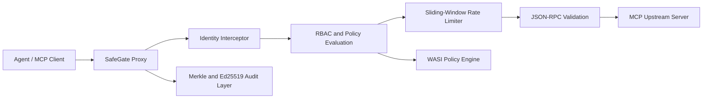

# MCP SafeGate - High-Performance Agent Security Proxy

MCP SafeGate is a Rust workspace for enforcing security controls in front of Model Context Protocol (MCP) servers. It provides a low-latency reverse-proxy boundary where agent identity, authorization, quotas, policy execution, and tamper-evident auditing can be applied before a request reaches an MCP tool server.

## Features

- **Agentic Identity**: Extracts agent and tenant context from HTTP headers and validates bearer credentials at the proxy boundary.
- **RBAC Tool-level evaluation**: Supports policy-driven authorization decisions scoped to individual MCP tool calls.
- **Sliding-Window Rate Limiter**: Provides concurrent, per-agent in-memory request quotas using `DashMap`.
- **Zero-Trust Architecture**: Rejects requests that lack a valid identity before parsing or forwarding the request body.

## Performance

| Metric | Result |
| --- | --- |
| Preprocessing Latency | < 2 µs (~1.82 µs) |
| Serialization/Deserialization | ~1.47 µs |
| Concurrent Capacity | 10,000+ RPS |

Measurements are produced with Criterion on the local development environment. Treat them as micro-benchmark reference values; validate throughput and tail latency against your deployment hardware and upstream workload.

## Architecture



The workspace is organized into four focused crates:

- `safegate-core`: shared MCP/JSON-RPC models, identity types, errors, and traits.
- `safegate-proxy`: Tokio and Hyper reverse proxy with identity enforcement and rate limiting.
- `safegate-wasm`: WASI 0.2 runtime and policy engine.
- `safegate-audit`: Merkle-tree and Ed25519 audit primitives.

## Quickstart

Prerequisites: the stable Rust toolchain and an MCP-compatible upstream listening on `http://127.0.0.1:3000`.

Start SafeGate:

```bash
cargo run -p safegate-proxy
```

Send an authenticated JSON-RPC tool call through the proxy:

```bash
curl --request POST http://127.0.0.1:8080/ \
  --header 'Content-Type: application/json' \
  --header 'Authorization: Bearer safegate-dev-token' \
  --header 'x-agent-id: example-agent' \
  --header 'x-tenant-id: example-tenant' \
  --data '{
    "jsonrpc": "2.0",
    "id": 1,
    "method": "tools/call",
    "params": {
      "name": "lookup",
      "arguments": { "query": "SafeGate" }
    }
  }'
```

The development token is intentionally a deterministic mock. Replace it with your identity-provider validation mechanism before deploying to production.

## Development

```bash
cargo fmt --all -- --check
cargo clippy --workspace -- -D warnings
cargo test --workspace
cargo bench -p safegate-proxy
```

## Security Notes

SafeGate is designed as a security boundary, but the current development bearer-token check is not a production authentication scheme. Use a verified JWT, mTLS, or an external identity provider; enforce secret rotation; and configure policy and audit retention to meet your operational requirements.
